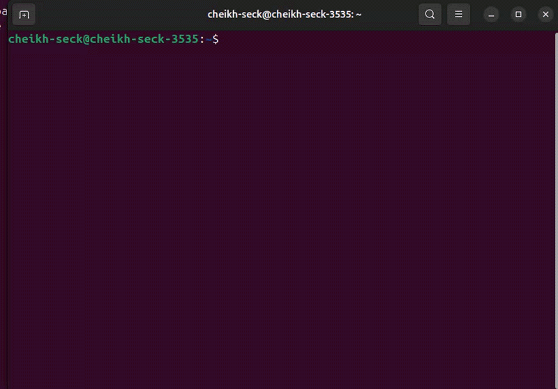

> [!WARNING]
> Please help me identify any security issues with this program.

> [!WARNING]
> I love adding features, please add any requests to the issue tab.

# GoDex - AI CLI Agent



GoDex is a CLI tool that interfaces with Ollama, Gemini, Hugging Face (and other LLM providers) through a TUI, with built-in MCP support.

## Requirements

- **Go 1.25.7+** - Build from source
- **Ollama** - For the default LLM backend (or use Gemini or Hugging Face)

### Ollama Setup

1. **Install Ollama**: Follow instructions at https://github.com/ollama/ollama

2. **Start Ollama server**:
   ```bash
   ollama serve
   ```

3. **Pull a model** (recommended: nemotron-3-super:cloud or minimax-m2.5:cloud):
   ```bash
   ollama pull nemotron-3-super:cloud
   # or
   ollama pull minimax-m2.5:cloud
   ```

4. **Verify Ollama is running**:
   ```bash
   curl http://localhost:11434
   ```

## Configuration

GoDex reads provider configuration from `~/.godex/providers.yaml`.

## Installation

### Build from Source

```bash
git clone https://github.com/cheikh2shift/godex.git
cd godex
go build -o godex ./cmd/godex
sudo mv godex /usr/local/bin/
```

### Quick Install (Linux/macOS)

```bash
curl -sSL https://raw.githubusercontent.com/cheikh2shift/godex/main/install.sh | sh
```

### Manual Download

Download from [GitHub Releases](https://github.com/cheikh2shift/godex/releases):

| OS | Architecture | File |
|----|-------------|------|
| Linux | AMD64 | `godex-linux-amd64` |
| Linux | ARM64 | `godex-linux-arm64` |
| macOS | AMD64 | `godex-darwin-amd64` |
| macOS | ARM64 | `godex-darwin-arm64` |
| Windows | AMD64 | `godex-windows-amd64.exe` |

Example:

**Linux (AMD64):**
```bash
curl -L -o godex https://github.com/cheikh2shift/godex/releases/latest/download/godex-linux-amd64
chmod +x godex
sudo mv godex /usr/local/bin/
```

**macOS (Intel):**
```bash
curl -L -o godex https://github.com/cheikh2shift/godex/releases/latest/download/godex-darwin-amd64
chmod +x godex
sudo mv godex /usr/local/bin/
```

**macOS (Apple Silicon):**
```bash
curl -L -o godex https://github.com/cheikh2shift/godex/releases/latest/download/godex-darwin-arm64
chmod +x godex
sudo mv godex /usr/local/bin/
```

### Quick Setup

Run the wizard to generate the config:
```bash
go run ./cmd/godex --wizard
```

### Manual Configuration

Create `~/.godex/providers.yaml`:

```yaml
providers:
  - name: ollama
    type: ollama
    endpoint: http://localhost:11434
    model: minimax-m2.5:cloud
    description: Ollama with codeqwen
    temperature: 0.2
    mcp_servers:
      - name: filesystem # enable file exploring
      - name: bash # enable command execution

default_provider: ollama
```

### Configuration Options

| Field | Description |
|-------|-------------|
| `name` | Provider identifier |
| `type` | Provider type: `ollama`, `gemini`, or `huggingface` |
| `endpoint` | Base URL for provider (Ollama: `http://localhost:11434`, Hugging Face: `https://router.huggingface.co/v1`) |
| `model` | Model name (e.g., `nemotron-3-super:cloud`, `codellama`, `minimax-m2.5:cloud`; Hugging Face supports routing suffixes like `:fastest` or `:provider`) |
| `description` | Human-readable description |
| `temperature` | LLM temperature (0.0-1.0) |
| `max_tool_rounds` | Max tool call rounds (default: 10) |
| `tool_timeout` | Tool execution timeout in seconds (default: 180) |
| `api_key_env` | Environment variable for API key (Gemini/Hugging Face) |
| `api_key` | Direct API key (not recommended) |
| `mcp_servers` | List of MCP servers to enable |

### MCP Servers

GoDex includes built-in MCP servers:

| Server | Description |
|--------|-------------|
| `filesystem` | Read, write, list directories, create/delete files |
| `bash` | Run shell commands, Python, Node.js |
| `webscraper` | Fetch URLs with JavaScript rendering, search HTML, extract links |

#### Adding Allowed Paths

By default, MCP servers only allow access to the current working directory. Add more allowed paths:

```yaml
mcp_servers:
  - name: filesystem
    allowed_paths:
      - /home/user/project1
      - /home/user/project2
  - name: bash
    allowed_paths:
      - /home/user/project1
  - name: webscraper
    allowed_urls:
      - https://example.com
      - https://docs.example.com
```

## Usage

### Quick Install

```bash
# Build from source (recommended)
go build -o godex ./cmd/godex
sudo mv godex /usr/local/bin/

# Or use install script (requires release)
curl -sSL https://raw.githubusercontent.com/cheikh2shift/godex/main/install.sh | sh
```

### Run

```bash
# Run the CLI (uses default provider from config)
godex

# Run with custom config file
godex --config /path/to/providers.yaml

# Run with specific provider (must exist in config)
godex --provider ollama

# Run with custom config and specific provider
godex --config /path/to/providers.yaml --provider gemini

# Run a single prompt (non-interactive)
godex --prompt "list files in current directory"

# Run wizard to create config
godex --wizard
```

### Commands in TUI

- `/help` - Show help
- `/paths` - Show allowed MCP paths
- `/add-path <path>` - Add allowed path
- `/tools` - Show available MCP tools
- `/exit` or `/quit` - Exit
- Up/Down arrows - Command history
- Tab - Autocomplete `/` commands

### Example Session

```
$ godex
GoDex - Connected to ollama (codeqwen)
MCP Servers: 2

> list files in this directory
[tool call: list_directory]
...
```

## Building

```bash
go build -o godex ./cmd/godex
./godex
```

## Troubleshooting

### Ollama Model Not Found

If you get an error like `{"error":"model 'qwen3-coder-next:cloud' not found"}`, it means the model hasn't been pulled yet. Run:

```bash
ollama pull <model-name>
```

Then test it works with:

```bash
ollama run <model-name>
```

### Ollama Not Running

Make sure Ollama is running in the background. You can start it with:

```bash
ollama serve
```

### Connection Issues

If GoDex can't connect to Ollama, check that the Ollama API is accessible at `http://localhost:11434`.


---

For developers: [DEV.md](DEV.md) - Guide to adding new MCP servers and providers
