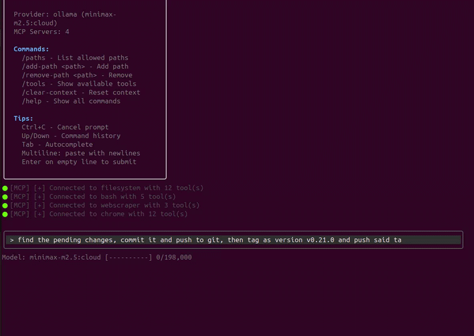

[](https://snapcraft.io/godex-ai-agent)
[](https://snapcraft.io/godex-ai-agent)

# GoDex - AI Agent

GoDex is an AI coding agent that interfaces with Ollama, llama.cpp, Gemini, OpenRouter (and other LLM providers) through a TUI, with built-in MCP support.

Orchestration and parallel tasks? open another terminal tab and start a new instance of `godex`.



## Requirements

- **Go 1.25.7+** - Build from source
- **Ollama** - For the default LLM backend (or use Gemini, OpenRouter, or llama.cpp)

## Table of Contents

- [Requirements](#requirements)
- [Installation](#installation)
  - [Quick Install](#quick-install-linuxmacos)
  - [Docker](#quick-install-docker)
  - [Build from Source](#build-from-source)
  - [Manual Download](#manual-download)
- [Setting up providers](#setting-up-providers)
  - [Ollama Setup](#ollama-setup)
  - [OpenRouter Setup](#openrouter-setup)
  - [llama.cpp Setup](#llamacpp-setup)
- [Configuration](#configuration)
  - [Quick Setup](#quick-setup)
  - [Manual Configuration](#manual-configuration)
  - [Configuration Options](#configuration-options)
  - [MCP Servers](#mcp-servers)
  - [Hive Network](#hive-network)
- [Usage](#usage)
  - [Shell Completion](#shell-completion)
  - [Commands in TUI](#commands-in-tui)
- [Building](#building)
- [Running Securely with Docker](#running-securely-with-docker)
- [Troubleshooting](#troubleshooting)

## Installation

### Quick Install (Linux/macOS)

```bash
curl -sSL https://raw.githubusercontent.com/cheikh2shift/godex/main/install.sh | sh
```

### Quick Install (Docker)

```bash
curl -sSL https://raw.githubusercontent.com/cheikh2shift/godex/main/install-docker.sh | bash
```

### Build from Source

```bash
git clone https://github.com/cheikh2shift/godex.git
cd godex
go build -o godex ./cmd/godex
sudo mv godex /usr/local/bin/
```

-------------------------------------------------------------

## Setting up providers

### Ollama Setup

1. **Install Ollama**: Follow instructions at https://github.com/ollama/ollama

2. **Start Ollama server**:
   ```bash
   ollama serve
   ```

3. **Pull a model** (recommended: nemotron-3-super:cloud or minimax-m2.7:cloud):
   ```bash
   ollama pull nemotron-3-super:cloud
   # or
   ollama pull minimax-m2.7:cloud
   ```

4. **Verify Ollama is running**:
   ```bash
   curl http://localhost:11434
   ```

### OpenRouter Setup

Launch Godex and choose `oauth` as the form of authentication to automatically obtain an API key or:

1. **Get an API key**: Sign up at https://openrouter.ai/keys

2. **Set the environment variable**:
   ```bash
   export OPENROUTER_API_KEY=sk-or-v1-...
   ```

3. **Run the wizard** to configure:
   ```bash
   godex --wizard
   ```
   Select `openrouter` as the provider type and choose from 100+ available models.

### llama.cpp Setup

1. **Install llama.cpp**: Download from https://github.com/ggerganov/llama.cpp/releases or build from source

2. **Ensure llama-server is in your PATH**: The binary should be named `llama-server` and accessible from command line

3. **Run the wizard** to configure:
   ```bash
   godex --wizard
   ```
   Select `llama.cpp` as the provider type. GoDex will automatically download models from Hugging Face or use local GGUF files.

4. **Using an external llama-server** (optional):
   ```bash
   # Start llama-server manually with jinja support for function calling
   llama-server -m models/your-model.gguf -fa -c 8192 --jinja
   
   # Connect godex to it
   godex --llama-server http://localhost:8080
   ```

## Configuration

GoDex reads provider configuration from `~/.godex/providers.yaml`.


### Manual Download

Download from [GitHub Releases](https://github.com/cheikh2shift/godex/releases):

| OS | Architecture | File |
|----|-------------|------|
| Linux | AMD64 | `godex-linux-amd64` |
| Linux | ARM64 | `godex-linux-arm64` |
| macOS | AMD64 | `godex-darwin-amd64` |
| macOS | ARM64 | `godex-darwin-arm64` |
| Windows | AMD64 | `godex-windows-amd64.exe` |

Example:

**Linux (AMD64):**
```bash
curl -L -o godex https://github.com/cheikh2shift/godex/releases/latest/download/godex-linux-amd64
chmod +x godex
sudo mv godex /usr/local/bin/
```

**macOS (Intel):**
```bash
curl -L -o godex https://github.com/cheikh2shift/godex/releases/latest/download/godex-darwin-amd64
chmod +x godex
sudo mv godex /usr/local/bin/
```

**macOS (Apple Silicon):**
```bash
curl -L -o godex https://github.com/cheikh2shift/godex/releases/latest/download/godex-darwin-arm64
chmod +x godex
sudo mv godex /usr/local/bin/
```

### Quick Setup

Run the wizard to generate the config:
```bash
godex --wizard
```

### Manual Configuration

Create `~/.godex/providers.yaml`:

```yaml
providers:
  - name: ollama
    type: ollama
    endpoint: http://localhost:11434
    model: minimax-m2.5:cloud
    description: Ollama with codeqwen
    temperature: 0.2
    mcp_servers:
      - name: filesystem # enable file exploring
      - name: bash # enable command execution

default_provider: ollama
```

Docker note: from inside the GoDex container, use `http://ollama-proxy:11434` to reach the nginx proxy, or `http://host.docker.internal:11434` to reach a host Ollama instance.

### Configuration Options

| Field | Description |
|-------|-------------|
| `name` | Provider identifier |
| `type` | Provider type: `ollama`, `llama.cpp`, `gemini` or `openrouter` |
| `endpoint` | Base URL for provider (Ollama: `http://localhost:11434`, llama.cpp: `http://localhost:8080`, OpenRouter: `https://openrouter.ai/api/v1`) |
| `model` | Model name (e.g., `nemotron-3-super:cloud`, `codellama`, `minimax-m2.7:cloud` |
| `description` | Human-readable description |
| `temperature` | LLM temperature (0.0-1.0) |
| `max_tool_rounds` | Max tool call rounds (default: 10) |
| `tool_timeout` | Tool execution timeout in seconds (default: 180) |
| `api_key_env` | Environment variable for API key (Gemini/OpenRouter) |
| `api_key` | Direct API key (not recommended) |
| `mcp_servers` | List of MCP servers to enable |
| `context_limit` | Context window size in tokens (auto-detected for OpenRouter) |

### MCP Servers

GoDex includes built-in MCP servers:

| Server | Description |
|--------|-------------|
| `filesystem` | Read, write, list directories, create/delete files |
| `bash` | Run shell commands, Python, Node.js |
| `webscraper` | Fetch URLs with JavaScript rendering, search HTML, extract links |

For detailed MCP configuration including external servers, see [MCP.md](MCP.md).

### Hive Network

GoDex supports a Hive network mode where multiple instances can delegate tasks to each other. See [HIVE.md](HIVE.md) for details.

#### Adding Allowed Paths

By default, MCP servers only allow access to the current working directory. Add more allowed paths:

```yaml
mcp_servers:
  - name: filesystem
    allowed_paths:
      - /home/user/project1
      - /home/user/project2
  - name: bash
    allowed_paths:
      - /home/user/project1
  - name: webscraper
    allowed_urls:
      - https://example.com
      - https://docs.example.com
```

## Usage

### Quick Install

```bash
# Build from source (recommended)
go build -o godex ./cmd/godex
sudo mv godex /usr/local/bin/

# Or use install script (requires release)
curl -sSL https://raw.githubusercontent.com/cheikh2shift/godex/main/install.sh | sh
```

### Run

```bash
# Run the TUI (uses default provider from config)
godex

# Run with custom config file
godex --config /path/to/providers.yaml

# Run with specific provider (must exist in config)
godex --provider ollama

# Run with custom config and specific provider
godex --config /path/to/providers.yaml --provider gemini

# Run a single prompt (non-interactive)
godex --prompt "list files in current directory"

# Run wizard to create config
godex --wizard

# Manage MCP servers in config
godex mcp add --provider ollama --name filesystem --allowed-path /home/user/project
godex mcp add --provider ollama --name webscraper --allowed-url https://docs.example.com
godex mcp add --provider ollama --name myserver --command /usr/local/bin/my-mcp --args --flag --allowed-path /tmp
godex mcp remove --provider ollama --name myserver
```

### Shell Completion

Enable tab completion for `godex` commands and provider names:

**Bash** (add to `~/.bashrc`):
```bash
source <(godex --completion bash)
```

**Zsh** (add to `~/.zshrc`):
```bash
source <(godex --completion zsh)
```

**Fish**:
```bash
godex --completion fish | source
```

After sourcing, pressing Tab will show:
- All available flags with descriptions
- Provider names when using `--provider`
- File paths when using `--config`
- `mcp` subcommands and flags

### Commands in TUI

- `/help` - Show help
- `/paths` - Show allowed MCP paths
- `/add-path <filesys|url> <path>` - Add allowed path
- `/tools` - Show available MCP tools
- `/commit <message>` - Save current chat history (CVC)
- `/commit-search <query>` - Search commits (CVC)
- `/commit-pull <ref>` - Restore a commit (CVC)
- `/commit-merge <ref>` - Merge a commit into current state (CVC)
- `/exit` or `/quit` - Exit
- Up/Down arrows - Command history
- Tab - Autocomplete `/` commands

GoDex includes CVC (Chat Version Control) for saving and restoring conversation state. See [CVC.md](CVC.md).

### Example Session

```
$ godex
GoDex - Connected to ollama (codeqwen)
MCP Servers: 2

> list files in this directory
[tool call: list_directory]
...
```

## Building

```bash
go build -o godex ./cmd/godex
./godex
```

## Running Securely with Docker

GoDex can be run in an isolated Docker container with a pre-configured sandbox environment containing common tools (Python, Node.js, Go, Rust, etc.).

### Quick Install

### Why Use Docker?

Running GoDex in Docker provides:
- **Isolation** - GoDex operates only within the mounted workspace directory
- **No host pollution** - Tools and changes stay contained
- **Consistent environment** - Same tools available regardless of host system
- **Safety** - Test configurations without risking your host system


### Usage

1. **First run** - The container will launch the wizard to configure your provider:
   ```bash
   WORKSPACE_DIR="$PWD" docker compose -f $HOME/godex/docker-compose.yml up
   ```
   Configure your Ollama/OpenRouter/etc. settings when prompted.
   If the screen looks empty after attaching, press Enter to trigger TUI redraw.
   If using Ollama on the host with the nginx proxy, make sure Ollama listens on `0.0.0.0:11434` (not just `127.0.0.1`), e.g. `OLLAMA_HOST=0.0.0.0:11434 ollama serve`.

#### Ollama Host Firewall (Optional)

If you want Ollama bound to `0.0.0.0` use:
```bash
sudo mkdir -p /etc/systemd/system/ollama.service.d
sudo tee /etc/systemd/system/ollama.service.d/override.conf >/dev/null <<'EOF'
[Service]
Environment="OLLAMA_HOST=0.0.0.0:11434"
EOF
sudo systemctl daemon-reload
sudo systemctl restart ollama

```

2. **Subsequent runs** - Your config is persisted in `$HOME/.godex`:
   ```bash
   WORKSPACE_DIR="$PWD" docker compose -f $HOME/godex/docker-compose.yml up -d && docket attach godex
   ```

**Note:** `WORKSPACE_DIR` controls which host directory is mounted at `/workspace` in the container. Set it to the directory you want GoDex to operate in (defaults to the compose file directory if unset).

3. **Edit provider config in `$HOME/.godex`**:
   ```bash
   nano $HOME/.godex/providers.yaml
   vi $HOME/.godex/providers.yaml
   vim $HOME/.godex/providers.yaml
   ```

### Included Tools in Docker

The sandbox includes:
- Python 3, pip, pytest, black, flake8
- Node.js, npm
- Go, Rust
- Git, curl, wget
- Build tools: make, cmake, gcc, g++
- Utilities: htop, tree, jq, ripgrep, fd, fzf, vim, nano

### Security Notes

- GoDex can only access files within the `./workspace` directory (read-write)
- Container runs as non-root user (set via `USER_ID`/`GROUP_ID`, defaults to `1000:1000`)
- Most Linux capabilities dropped; only `NET_RAW` and `NET_BIND_SERVICE` allowed
- No new privileges allowed
- `/tmp` and `/run` use tmpfs (memory-only, non-persistent)
- No explicit process/file limits (inherits host defaults)
- Network isolated via nginx proxy (host port `11435` forwards to `ollama-proxy:11434`, which proxies to host `11434`)
- Provider credentials are stored in `$HOME/.godex`
- Use `docker compose -f $HOME/godex/docker-compose.yml down -v` to completely remove all data

## Troubleshooting

### Ollama Model Not Found

If you get an error like `{"error":"model 'qwen3-coder-next:cloud' not found"}`, it means the model hasn't been pulled yet. Run:

```bash
ollama pull <model-name>
```

Then test it works with:

```bash
ollama run <model-name>
```

### Ollama Not Running

Make sure Ollama is running in the background. You can start it with:

```bash
ollama serve
```

### Connection Issues

If GoDex can't connect to Ollama, check that the Ollama API is accessible at `http://localhost:11434`.


---

For developers: [DEV.md](DEV.md) - Guide to adding new MCP servers and providers
